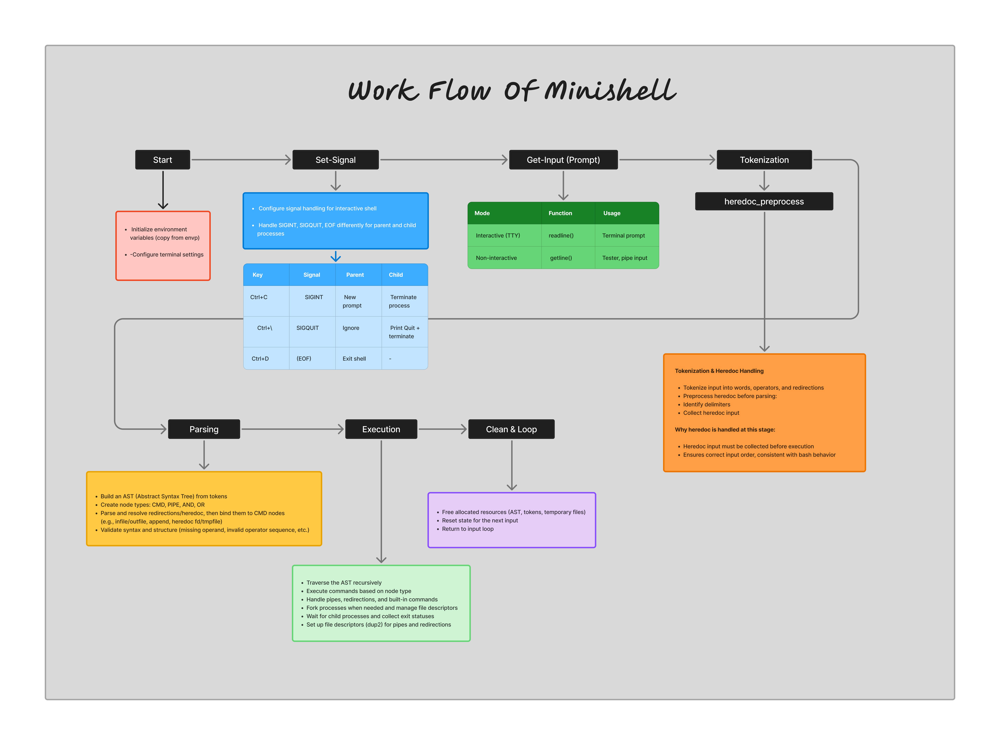

# MINISHELL

A POSIX-style shell with pipelines, redirections, and logical operators—built with a clear tokenize → parse → execute pipeline and an AST-based execution model.

---

## Demo


▶ Full terminal recording: https://asciinema.org/a/1WY066ZiBwrpoHLr

---

## Supported Features

- **Built-in commands**: `echo`, `cd`, `pwd`, `export`, `unset`, `env`, `exit`
- **Pipelines**: unlimited chaining (`cmd1 | cmd2 | cmd3 ...`)
- **Logical operators**: `&&`, `||` with proper short-circuit evaluation
- **Redirections**: `<`, `>`, `>>`, `<<` (heredoc), `<<<` (herestring)
- Quote-aware parsing (single & double quotes) with expansion only inside double quotes
- Variable expansion: `$VAR`, `$?`
- Context-aware signal handling (`Ctrl+C`, `Ctrl+D`, `Ctrl+\`)
- Correct stdin precedence when combining heredoc and herestring (Bash-aligned)

---

## Architecture

End-to-end flow from prompt to execution and cleanup:



- **Start** — Copy environment, set up terminal.
- **Set-Signal** — Different behavior in parent vs child: `SIGINT` (new prompt / terminate), `SIGQUIT` (ignore / quit), `EOF` (exit shell).
- **Get-Input** — Interactive: `readline()`; non-interactive: `getline()` for scripts/pipes.
- **Tokenization & Heredoc** — Split into words, operators, redirections; **heredoc is preprocessed here** (delimiters found, body collected) so input order matches Bash before parsing.
- **Parsing** — Build AST from tokens; attach redirections to command nodes; validate syntax.
- **Execution** — Recursive AST traversal, fork/exec, pipes and FDs, wait and exit codes.
- **Clean & Loop** — Free AST, tokens, temp data; loop back to prompt.

**Why heredoc at tokenization:** Heredoc content must be read before execution, and doing it during tokenization keeps input order and semantics consistent with standard shell behavior.

---

## AST (Abstract Syntax Tree)

Commands and operators are represented as a tree; parsing builds it, execution walks it.

.png)


- **Operation nodes** (`|`, `&&`, `||`): inner nodes that define **control flow** between children.
  - `&&` / `||` apply short-circuit evaluation
  - `|` executes both sides unconditionally and connects FDs

- **Command nodes**: leaf nodes that hold the **command, arguments, and redirections** to be executed.

- **Red arrows** → **parsing (construction) phase**: node creation and tree linking  
  (e.g. linking a command node as the right child of a pipe node)

- **Blue arrows** → **execution phase**: tree traversal,  
  short-circuit evaluation, `pipe()` syscall, and FD (stdin/stdout) setup

This separation keeps parsing and execution phases clear and makes operator precedence and complex expressions straightforward to handle.

---

## How It Works (Summary)

1. **Tokenization & expansion**  
   Input is tokenized with quote and operator awareness. Heredoc (and herestring) input is collected in this phase. Expansion is applied where required (e.g. inside double quotes).

2. **AST construction**  
   Tokens are turned into an **Abstract Syntax Tree** that encodes precedence and structure (command vs operation nodes).

3. **Recursive execution**  
   The AST is executed by recursive traversal, enforcing precedence (`|` > `&&` = `||`) and short-circuit behavior. Stdin source precedence for `<`, `<<`, and `<<<` is explicitly resolved to match Bash.

---

## Code Structure

```text
srcs/
├── tokenize/         # Lexical analysis, quote handling, heredoc preprocessing
├── parsing/          # AST construction & redirection/heredoc binding
├── execution/        # fork/exec, pipelines, FD control
├── builtin/          # Built-in command implementations
├── expand/           # Variable & quote expansion ($VAR, $?, double-quote only)
├── heredoc_string/   # Heredoc/herestring execution & herestring expansion
├── signal/           # Signal setup and recovery (parent/child distinction)
├── error_log/        # Centralized error handling
└── utils/            # Memory-safe helpers
```

---

## Recent Improvements

- **Heredoc at tokenization**  
  Heredoc delimiter detection and body collection moved into the tokenization phase so input order and semantics align with Bash before parsing and execution.

- **Quote handling**  
  Expand phase keeps opening/closing quotes in the buffer so a later `rm_quotes` step removes them in one place without stripping meaningful characters inside quoted regions.

- **Signal handling**  
  Reworked using `sigsetjmp` / `siglongjmp` to safely abort execution in the main process without extra `fork()` for readline.

- **Heredoc & herestring**  
  Refactored to run in the main process (no unnecessary fork); fixed variable expansion in double-quoted herestrings; corrected stdin precedence (e.g. `cat << LIMITER <<< "hi"`).

- **Exit codes & input modes**  
  Fixed exit code propagation for `exit` without arguments; added dual input handling (interactive: `readline()`, non-interactive: `getline()`).

- **Code cleanup**  
  Shared helpers (e.g. `check_input_set`) for quote/ref checks; removed redundant and commented-out includes and declarations from headers.

---

## Running Tests

```bash
bash tests/tester_cases.sh       # Functional tests (stdout / stderr)
bash tests/tester_exitcode.sh    # Exit code validation
bash tests/tester_fd.sh           # File descriptor leak checks
bash tests/valgrind.sh            # Memory leak detection
```

### Test Cases

| File                  | Description                                  |
| --------------------- | -------------------------------------------- |
| `01_basic.ms`         | Basic commands (`echo`, `pwd`, `env`)        |
| `02_builtins.ms`      | Built-in commands (`cd`, `export`, `exit`)   |
| `03_quotes.ms`        | Single, double, and multiline quotes        |
| `04_redirections.ms`  | Input/output/append redirections            |
| `05_pipes.ms`         | Pipe chains (2–10 stages)                   |
| `06_heredoc.ms`       | Heredoc with variable expansion             |
| `07_herestring.ms`    | Herestring (`<<<`)                          |
| `08_logic_ops.ms`     | Logical operators (`&&`, `||`)               |
| `09_exit_codes.ms`    | Exit code propagation                       |
| `10_edge_cases.ms`    | Error handling and edge cases               |
| `11_comprehensive.ms` | Full integration test                      |
| `fd_management.ms`    | File descriptor management                  |

---

## Authors

**skwon2** — Hive Helsinki (42 Network)  
**hlee-sun** — Hive Helsinki (42 Network)

---

Developed as part of the **42 Network curriculum** at Hive Helsinki.
